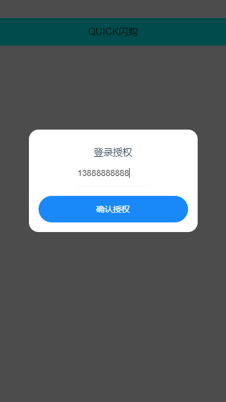
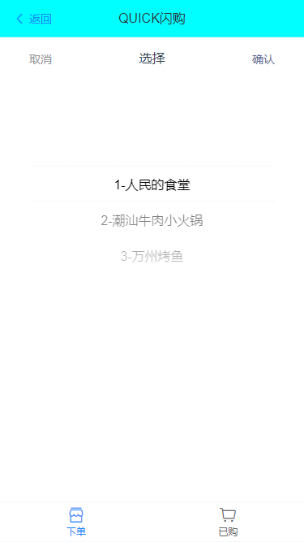
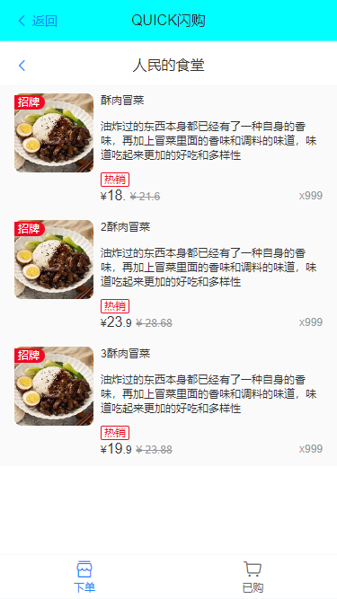
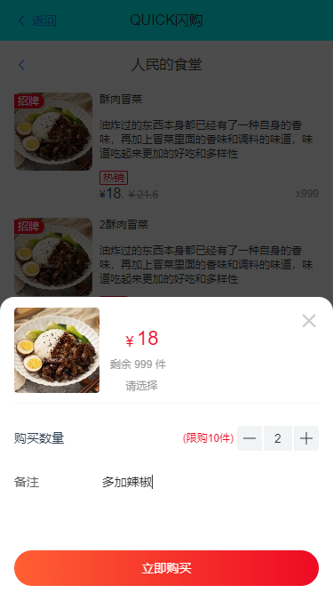
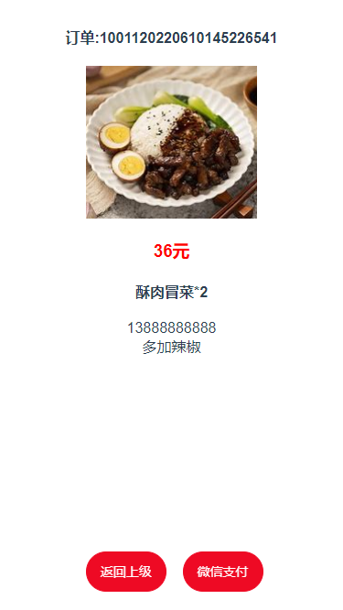
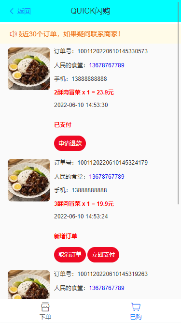
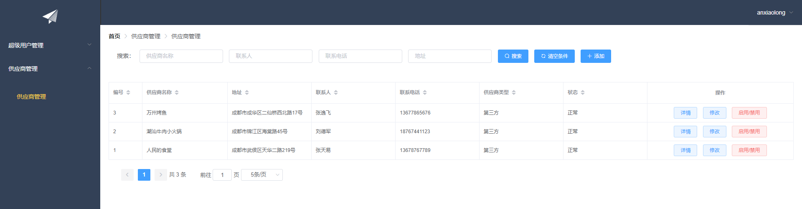
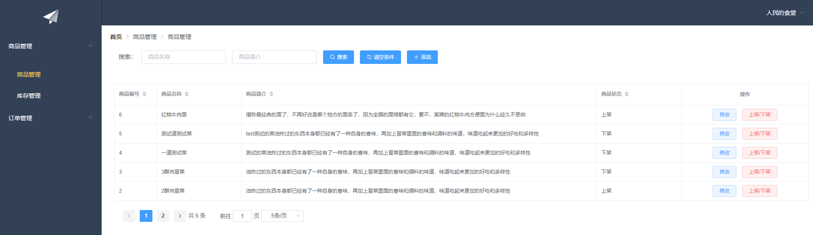
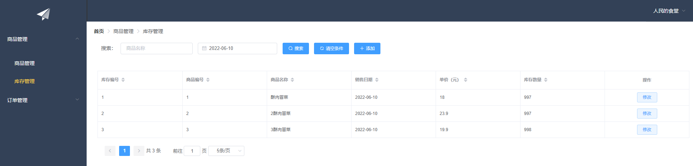
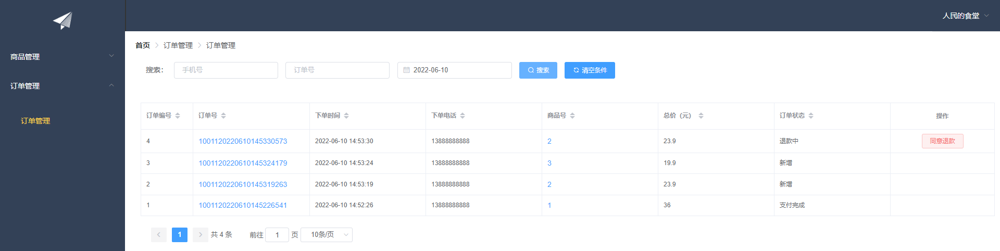

# QUICK闪购
***

## 技术栈
- 后端
    - Spring Boot
    - Spring MVC
    - MyBatis
    - Dubbo
    - Redis
        - Spring Data Redis
        - Redisson
    - ZooKeeper
    - MySql
    - Docker
    - Swagger
    - Jmeter
- 前端
    - Vue2
        - Vue CLI
        - Vue Router
        - Vuex
    - Axios
    - Element
    - Vant
***

## 资料说明
- 数据库
    - doc/dump-quick_order-202206091651.sql
- maven结构
    - quick-order（root）
        - quick-order-management
        - quick-order-pojo
        - quick-order-common
        - quick-order-supplier
        - quick-order-internet
- vue项目
    - management（管理端）
    - quick-order-mobile（移动端）
- 接口测试脚本
    - doc/quick-order.jmx
- 压测脚本（库存数据线程安全验证）
    - doc/下单流程压力测试.jmx
***

## 移动端展示

***
## 管理端展示

